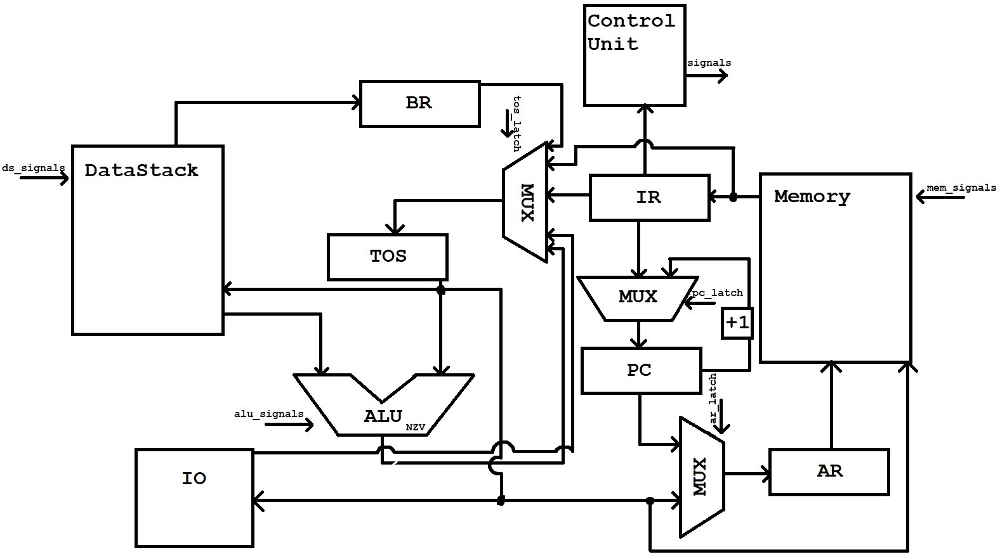
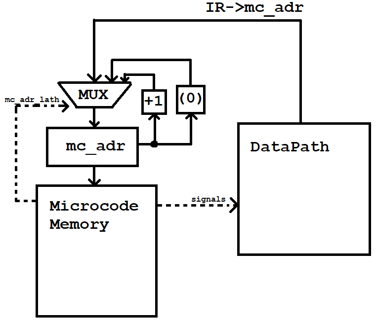

# Лабараторная работа №3

---
Злобин Николай Андреевич P3216
`forth | stack | neum | mc | tick | struct | stream | port | cstr | prob1 
`
Выполнен базовый вариант

## Язык программирования

---

### Синтаксис

__Форма Бэкуса-Наура:__

``` форма Бэкуса-Наура
<program> ::= <term> | <term> "\n" <program>

<term> ::= <variables> | <words> | <call_words> | <commands>

<variables> ::= <set_variable> | <variable_on_top_stack>
<set_variable> ::= <number> <string_name> "!"
<variable_on_top_stack> ::= <string_name> "@"

<words> ::= ":" <string_name> "\n" <commands> ";"
<call_words> ::= <string_name>

<if> ::= "if" <term> "then"
<if_else> ::= "if" <term> "else" <term> "then"
<loop> ::= "begin" <term> "until"

<commands> ::= <command> | <command> "\n" <commands>
<command> ::= "+" | "-" | "*" | "/" | "mod" |
              "dup" | "drop" | "swap" |
              "=" | ">" | "<" | "." |
              "exit" | <variables> | <if> |
              <if_else | <loop> | "emit"
<number> ::= -?[1-9][0-9]*
<string_name> ::= [A-Za-z][A-Za-z0-9]*
```

### Особенности языка

- Используется обратная польская запись для вычислений
- Все переменные хранятся в стеке
- Forth не имеет объявления типов данных
- Есть целочисленные и строковые литералы

### Операции

| __Операции__ | __Стек__                     | __Описание__                                                                       |
|-------------|------------------------------|------------------------------------------------------------------------------------|
| +           | (... a b) --> (... a + b)    | Складываем два верхних числа со стека и кладем на вершину сумму                    |
| -           | (... a b) --> (... a - b)    | Вычитаем из a число b и кладем разность на вершину                                 |
| *           | (... a b) --> (... a * b)    | Умножаем два верхних числа со стека и кладем на вершину результат                  |
| /           | (... a b) --> (... a / b)    | Делим a на число b и кладем результат на вершину стека                             |
| mod         | (... a b) --> (... a mod b)  | Кладем остаток от деления a на b на вершину стека                                  |
| dup         | (... a) --> (... a a)        | Дублирует число с вершины стека и кладет дубликат на вершину                       |
| drop        | (... a) --> (...)            | Удаляет число с вершины стека                                                      |
| swap        | (... a b) --> (... b a)      | Меняет местами два числа, которые лежат на вершине стека                           |
| =           | (... a b) --> (... a = b)    | Если a равно b, то кладем 1 на вершину стека, иначе 0                              |
| \>          | (... a b) --> (... a > b)    | Если b больше a, то кладем 1 на вершину стека, иначе 0                             |
| \<          | (... a b) --> (... a < b)    | Если b меньше a, то кладем 1 на вершину стека, иначе 0                             |
| .           | (... a) --> output(a)        | Печатаем вершину стека в output как число                                          |
| exit        | -                            | Завершаем программу                                                                |
| (a addr) !  | (...)\[addr\] = a            | Сохраняет a по адресу (addr)                                                       |
| (addr) @ | (...)\[addr\] --> (... a)    | Кладет на вершину стека число, которое лежит по адресу                             |
| # | input --> ...a               | Считывает значение из input и кладет на вершину стека                              |
| if | a == True ip++, jmp n        | Если на вершине стека True, то перейдем далее, иначе перейдем на else или endif    |
| else | -                            | Если при команде if на стеке лежало False, то программа перейдет сюда              |
| endif | -                            | Если при команде if на стеке лежало False и нету else, то программа перейдет сюда  |
| begin | -                            | Начало цикла (куда программа будет каждый раз возвращаться                         |
| until | -                            | Если на вершине стека лежит True, то завершит цикл, иначе перейдет на начало цикла |
| emit | (... a) --> output(ascii(a)) | Печатаем вершину стека как символ ASCII |

- : <слово> <команды> ; - Объявление процедуры
- if <true-команды> \[else <false-команды>\] endif - Если вершина стека != 0, то выполняется <true-команды>, иначе выполняется <false-команды>, если они есть
- begin <команды> until - Цикл, который работает пока перед командой until на вершине стека не будет 1
- ." <строка>" - Вывод <строка> в stdout

### Организация памяти

---

Память команд и данных общая. Существует также DataStack, который может быть использован программистом  

Память соответствует фон Неймановской архитектуре. Память программы состоит из: 1 элемент хранит в себе адрес начала хранения переменных, дальше хранятся машинные слова от первого элемента до переменных, после хранятся сами переменные. Обращение к памяти производится через регистр adress_register

### Система команд

---

- Машинное слово -- не определено. Передается как словарь
- Доступ к памяти осуществляется по адресу, хранящемуся в регистре PC. Изменить данный регистр можно следующими способами:
  - Инкрементировать данный регистр
  - Записи аргумента из машинного слова (при таких контрукциях как jmp, jzs)
- Поток управления:
  - Инкремент PC после каждой инструкции
  - условный и бузусловный переход

#### Набор инструкций

---
Команды языка однозначно транслируются в инструкции

| __Инструкции__ | __Количество тактов__ |
|----------------|-----------------------|
| Fetch | 6 |
| ADD | 7 |
| SUB | 7 |
| MUL | 7 |
| DIV | 7 |
| MOD | 7 |
| DUP | 5 |
 | DROP | 5 |
| SWAP | 8 |
| EQ | 7 |
| NOT_EQ | 7 |
| MORE | 7 |
| LESS | 7 |
| PUSH | 6 |
| ADR_ON_TOP | 6 |
| SAVE_VAR | 12 |
| VAR_ON_TOP | 9 |
| JZS | 11 |
| JMP | 10 |
| PRINT | 8 |
| READ | 6 |
| EMIT | 8 |  
| HALT | 2 |

Такты каждой интрукции высчитываются по тому, сколько в ней есть сигналов, который посылаются машине. Инструкция fetch нужна для выборки следующей команды

### Транслятор

---

Интерфейс командной строки: `.\generator.py  <source.file> <target.file>`  
Реализован в .\generator.py 

#### Этапы транслирования

1. Первый этап - перевод текста в terms. Класс с контруктором(номер_линии, номер_слова, слово). Также записывание всех имен переменных, процедур и строк на вывод (реализован в файле `lexer.py`)
2. Второй этап - перевод терм в машинные слова (функция `translate`)
3. Третий этап - выделение памяти для каждой переменной
4. Четвертый этап - запись строк в память

### Модель процессора

Интерфейс командной строки: `machine.py <machine_code_file> <input_file> <log_file>`

#### DataPath


Реализован в классе [DP](data_path.py)  
`IR` - регистр для хранения машинного слова  
`PC` - указатель на место в памяти, от куда брать следующее машинное слово  
`AR` - регистр для хранения адреса, по которому программа обращается к памяти  
`TOS` - регистр для хранения вершины стека  
`BR` - регистр для для промежуточного хранения из DataStack  
`DataStack` - стек данных  
`Memory` - общая память программы  
На схеме также изображены сигналы, которые приходят из `ControlUnit`, по которым выполняется определенное действие  

#### ControlUnit


Реализован в классе [CU](control_unit.py)  
`mc_adr` - регистр для хранения адреса микрокоманды, которую надо выполнить  
`MicrocodeMemory` - память микрокоманд, где прописана каждая интрукция  
Считывает по адресу массив сигналов, выполняет каждый из них и отсылает в нужное место  
Тики считают, сколько сигналов было отправлено

#### Сигналы

- DSLatch (Push, Pop) - сигнал для DataStack
- ARLatch (PC, TOS) - прием на `address_register`
- IRLatch (MEM) - прием данных на `instraction_register`
- PCLatch (IR, INC) - прием данных на `pc`
- TosLatch (MEM, IR, BR, ALU, IR_VAR) - прием данных на `top_of_stack`
- ALUValues (VAR) - запись двух чисел в `alu`
- AluLatch (SUM, SUB, DIV, MOD, NOT_EQ, EQ, MORE, LESS) - выбор арифметического действия
- MEMSignal (READ, WRITE, TOS) - сигнал для `memory`
- MCAdrLatch (IR, INC, ZERO) - прием данных на `mc_adr`
- BRLatch (DS) - запрос данных на `buffer_register` от `DataStack`
- CheckFlag (Z, N, V) - проверка флага
- Jumps (JMP, JZS) - выбор перехода
- IOLatch (PRINT, READ, EMIT) - работа с вводом/выводом
- PROG (HALT) - завершение программы
- Instraction (INC) - увелечение счетчика интрукций на один

#### Особенности работы модели

- Цикл симуляции осуществляется в функции `run_machine`
- Шаг моделирования соответсвует одному тику программы с выводом состояния в журнал
- Для журнала состояний процессора используется стандратный модуль logging
- Количество интрукций для моделирования лимиировано


### Тестирование

---

Тестирование выполняется при помощи golden-тестов  
Запуск golden-тестов: [golden_test](golden_test.py)  
Тесты:

- [tests/cat.yml](tests/cat.yml) - Выводит символы в stdout из stdin, пока не закончаться в буфере
- [tests/hello_world.yml](tests/hello_world.yml) - Выводит в stdou "Hello, World!"
- [tests/prob2.yml](tests/prob1.yml) - Выводит сумму всех чисел <1000 и кратных 3 или 5

Запустить тесты: `poetry run pytest . -v`  
CI при помощи GitHub Actions:

```yaml

```

где:

- poetry - инструмент для управления зависимостьями в Python
- coverage - формирование отчета об уровне покрытия исходного кода тестами
- pytest - утилита для запуска тестов
- rugg - утилита для формирования и проверки стиля кода

Пример использования и журнал работы прроцессора на примере `cat`:
```test
in_source: |-
  : cat
      begin
          # dup dup
          0 !=
          if
              emit
          endif
          0 =
      until
  ;
  cat
  exit
in_stdin: |-
  kvadrobober
out_code: |-
  [{
      "index": 0,
      "opcode": "read",
      "term": [
          3,
          1,
          "#"
      ]
  },
  {
      "index": 1,
      "opcode": "dup",
      "term": [
          3,
          2,
          "dup"
      ]
  },
  {
      "index": 2,
      "opcode": "dup",
      "term": [
          3,
          3,
          "dup"
      ]
  },
  {
      "index": 3,
      "opcode": "push",
      "arg": "0",
      "term": [
          4,
          1,
          "0"
      ]
  },
  {
      "index": 4,
      "opcode": "not_eq",
      "term": [
          4,
          2,
          "!="
      ]
  },
  {
      "index": 5,
      "opcode": "jzs",
      "arg": 7
  },
  {
      "index": 6,
      "opcode": "emit",
      "term": [
          6,
          1,
          "emit"
      ]
  },
  {
      "index": 7,
      "opcode": "push",
      "arg": "0",
      "term": [
          8,
          1,
          "0"
      ]
  },
  {
      "index": 8,
      "opcode": "eq",
      "term": [
          8,
          2,
          "="
      ]
  },
  {
      "index": 9,
      "opcode": "jzs",
      "arg": 0
  },
  {
      "index": 10,
      "opcode": "halt",
      "term": [
          12,
          1,
          "exit"
      ]
  }]
out_stdout: |-
  OK.
  ============================================================
  kvadrobober

  instruction_count: 240
  tick: 1577
out_log: |-
  [DEBUG]  TICK: 0    SIGNAL: ARLatch.PC      AR: 0   PC: 1    MC_ADR: 1   TOS: 0      Z: 0 N: 0 V: 0 DS: []
  [DEBUG]  TICK: 1    SIGNAL: MEMSignal.READ  AR: 0   PC: 1    MC_ADR: 1   TOS: 0      Z: 0 N: 0 V: 0 DS: []
  [DEBUG]  TICK: 2    SIGNAL: MCAdrLatch.INC  AR: 1   PC: 1    MC_ADR: 1   TOS: 0      Z: 0 N: 0 V: 0 DS: []
  [DEBUG]  TICK: 3    SIGNAL: IRLatch.MEM     AR: 1   PC: 1    MC_ADR: 1   TOS: 0      Z: 0 N: 0 V: 0 DS: []
  [DEBUG]  TICK: 4    SIGNAL: Instruction.INC AR: 1   PC: 1    MC_ADR: 1   TOS: 0      Z: 0 N: 0 V: 0 DS: []
  [DEBUG]  TICK: 5    SIGNAL: MCAdrLatch.IR   AR: 44  PC: 1    MC_ADR: 1   TOS: 0      Z: 0 N: 0 V: 0 DS: []
  [DEBUG]  TICK: 6    SIGNAL: DSLatch.Push    AR: 44  PC: 1    MC_ADR: 1   TOS: 0      Z: 0 N: 0 V: 0 DS: []
  [DEBUG]  TICK: 7    SIGNAL: MCAdrLatch.INC  AR: 45  PC: 1    MC_ADR: 1   TOS: 0      Z: 0 N: 0 V: 0 DS: []
  [DEBUG]  input: k
  [DEBUG]  TICK: 8    SIGNAL: IOLatch.READ    AR: 45  PC: 1    MC_ADR: 1   TOS: 107    Z: 0 N: 0 V: 0 DS: []
  [DEBUG]  TICK: 9    SIGNAL: Instruction.INC AR: 45  PC: 1    MC_ADR: 1   TOS: 107    Z: 0 N: 0 V: 0 DS: []
  [DEBUG]  TICK: 10   SIGNAL: PCLatch.INC     AR: 45  PC: 2    MC_ADR: 1   TOS: 107    Z: 0 N: 0 V: 0 DS: []
  [DEBUG]  TICK: 11   SIGNAL: MCAdrLatch.ZERO AR: 0   PC: 2    MC_ADR: 1   TOS: 107    Z: 0 N: 0 V: 0 DS: []
  [DEBUG]  TICK: 12   SIGNAL: ARLatch.PC      AR: 0   PC: 2    MC_ADR: 2   TOS: 107    Z: 0 N: 0 V: 0 DS: []
  [DEBUG]  TICK: 13   SIGNAL: MEMSignal.READ  AR: 0   PC: 2    MC_ADR: 2   TOS: 107    Z: 0 N: 0 V: 0 DS: []
  [DEBUG]  TICK: 14   SIGNAL: MCAdrLatch.INC  AR: 1   PC: 2    MC_ADR: 2   TOS: 107    Z: 0 N: 0 V: 0 DS: []
  [DEBUG]  TICK: 15   SIGNAL: IRLatch.MEM     AR: 1   PC: 2    MC_ADR: 2   TOS: 107    Z: 0 N: 0 V: 0 DS: []
  [DEBUG]  TICK: 16   SIGNAL: Instruction.INC AR: 1   PC: 2    MC_ADR: 2   TOS: 107    Z: 0 N: 0 V: 0 DS: []
  [DEBUG]  TICK: 17   SIGNAL: MCAdrLatch.IR   AR: 12  PC: 2    MC_ADR: 2   TOS: 107    Z: 0 N: 0 V: 0 DS: []
  [DEBUG]  TICK: 18   SIGNAL: DSLatch.Push    AR: 12  PC: 2    MC_ADR: 2   TOS: 107    Z: 0 N: 0 V: 0 DS: [107]
  [DEBUG]  TICK: 19   SIGNAL: MCAdrLatch.INC  AR: 13  PC: 2    MC_ADR: 2   TOS: 107    Z: 0 N: 0 V: 0 DS: [107]
  [DEBUG]  TICK: 20   SIGNAL: PCLatch.INC     AR: 13  PC: 3    MC_ADR: 2   TOS: 107    Z: 0 N: 0 V: 0 DS: [107]
  [DEBUG]  TICK: 21   SIGNAL: Instruction.INC AR: 13  PC: 3    MC_ADR: 2   TOS: 107    Z: 0 N: 0 V: 0 DS: [107]
  [DEBUG]  TICK: 22   SIGNAL: MCAdrLatch.ZERO AR: 0   PC: 3    MC_ADR: 2   TOS: 107    Z: 0 N: 0 V: 0 DS: [107]
  [DEBUG]  TICK: 23   SIGNAL: ARLatch.PC      AR: 0   PC: 3    MC_ADR: 3   TOS: 107    Z: 0 N: 0 V: 0 DS: [107]
  [DEBUG]  TICK: 24   SIGNAL: MEMSignal.READ  AR: 0   PC: 3    MC_ADR: 3   TOS: 107    Z: 0 N: 0 V: 0 DS: [107]
  [DEBUG]  TICK: 25   SIGNAL: MCAdrLatch.INC  AR: 1   PC: 3    MC_ADR: 3   TOS: 107    Z: 0 N: 0 V: 0 DS: [107]
  [DEBUG]  TICK: 26   SIGNAL: IRLatch.MEM     AR: 1   PC: 3    MC_ADR: 3   TOS: 107    Z: 0 N: 0 V: 0 DS: [107]
  [DEBUG]  TICK: 27   SIGNAL: Instruction.INC AR: 1   PC: 3    MC_ADR: 3   TOS: 107    Z: 0 N: 0 V: 0 DS: [107]
  [DEBUG]  TICK: 28   SIGNAL: MCAdrLatch.IR   AR: 12  PC: 3    MC_ADR: 3   TOS: 107    Z: 0 N: 0 V: 0 DS: [107]
  [DEBUG]  TICK: 29   SIGNAL: DSLatch.Push    AR: 12  PC: 3    MC_ADR: 3   TOS: 107    Z: 0 N: 0 V: 0 DS: [107, 107]
  [DEBUG]  TICK: 30   SIGNAL: MCAdrLatch.INC  AR: 13  PC: 3    MC_ADR: 3   TOS: 107    Z: 0 N: 0 V: 0 DS: [107, 107]
  [DEBUG]  TICK: 31   SIGNAL: PCLatch.INC     AR: 13  PC: 4    MC_ADR: 3   TOS: 107    Z: 0 N: 0 V: 0 DS: [107, 107]
  [DEBUG]  TICK: 32   SIGNAL: Instruction.INC AR: 13  PC: 4    MC_ADR: 3   TOS: 107    Z: 0 N: 0 V: 0 DS: [107, 107]
  [DEBUG]  TICK: 33   SIGNAL: MCAdrLatch.ZERO AR: 0   PC: 4    MC_ADR: 3   TOS: 107    Z: 0 N: 0 V: 0 DS: [107, 107]
  [DEBUG]  TICK: 34   SIGNAL: ARLatch.PC      AR: 0   PC: 4    MC_ADR: 4   TOS: 107    Z: 0 N: 0 V: 0 DS: [107, 107]
  [DEBUG]  TICK: 35   SIGNAL: MEMSignal.READ  AR: 0   PC: 4    MC_ADR: 4   TOS: 107    Z: 0 N: 0 V: 0 DS: [107, 107]
  [DEBUG]  TICK: 36   SIGNAL: MCAdrLatch.INC  AR: 1   PC: 4    MC_ADR: 4   TOS: 107    Z: 0 N: 0 V: 0 DS: [107, 107]
  [DEBUG]  TICK: 37   SIGNAL: IRLatch.MEM     AR: 1   PC: 4    MC_ADR: 4   TOS: 107    Z: 0 N: 0 V: 0 DS: [107, 107]
  [DEBUG]  TICK: 38   SIGNAL: Instruction.INC AR: 1   PC: 4    MC_ADR: 4   TOS: 107    Z: 0 N: 0 V: 0 DS: [107, 107]
  [DEBUG]  TICK: 39   SIGNAL: MCAdrLatch.IR   AR: 25  PC: 4    MC_ADR: 4   TOS: 107    Z: 0 N: 0 V: 0 DS: [107, 107]
  [DEBUG]  TICK: 40   SIGNAL: DSLatch.Push    AR: 25  PC: 4    MC_ADR: 4   TOS: 107    Z: 0 N: 0 V: 0 DS: [107, 107, 107]
  [DEBUG]  TICK: 41   SIGNAL: TosLatch.IR     AR: 25  PC: 4    MC_ADR: 4   TOS: 0      Z: 0 N: 0 V: 0 DS: [107, 107, 107]
  [DEBUG]  TICK: 42   SIGNAL: MCAdrLatch.INC  AR: 26  PC: 4    MC_ADR: 4   TOS: 0      Z: 0 N: 0 V: 0 DS: [107, 107, 107]
  [DEBUG]  TICK: 43   SIGNAL: PCLatch.INC     AR: 26  PC: 5    MC_ADR: 4   TOS: 0      Z: 0 N: 0 V: 0 DS: [107, 107, 107]
  [DEBUG]  TICK: 44   SIGNAL: Instruction.INC AR: 26  PC: 5    MC_ADR: 4   TOS: 0      Z: 0 N: 0 V: 0 DS: [107, 107, 107]
  [DEBUG]  TICK: 45   SIGNAL: MCAdrLatch.ZERO AR: 0   PC: 5    MC_ADR: 4   TOS: 0      Z: 0 N: 0 V: 0 DS: [107, 107, 107]
  [DEBUG]  TICK: 46   SIGNAL: ARLatch.PC      AR: 0   PC: 5    MC_ADR: 5   TOS: 0      Z: 0 N: 0 V: 0 DS: [107, 107, 107]
  [DEBUG]  TICK: 47   SIGNAL: MEMSignal.READ  AR: 0   PC: 5    MC_ADR: 5   TOS: 0      Z: 0 N: 0 V: 0 DS: [107, 107, 107]
  [DEBUG]  TICK: 48   SIGNAL: MCAdrLatch.INC  AR: 1   PC: 5    MC_ADR: 5   TOS: 0      Z: 0 N: 0 V: 0 DS: [107, 107, 107]
  [DEBUG]  TICK: 49   SIGNAL: IRLatch.MEM     AR: 1   PC: 5    MC_ADR: 5   TOS: 0      Z: 0 N: 0 V: 0 DS: [107, 107, 107]
  [DEBUG]  TICK: 50   SIGNAL: Instruction.INC AR: 1   PC: 5    MC_ADR: 5   TOS: 0      Z: 0 N: 0 V: 0 DS: [107, 107, 107]
  [DEBUG]  TICK: 51   SIGNAL: MCAdrLatch.IR   AR: 50  PC: 5    MC_ADR: 5   TOS: 0      Z: 0 N: 0 V: 0 DS: [107, 107, 107]
  [DEBUG]  TICK: 52   SIGNAL: ALUValues.VAR   AR: 50  PC: 5    MC_ADR: 5   TOS: 0      Z: 0 N: 0 V: 0 DS: [107, 107]
  [DEBUG]  TICK: 53   SIGNAL: AluLatch.NOT_EQ AR: 50  PC: 5    MC_ADR: 5   TOS: 0      Z: 0 N: 0 V: 0 DS: [107, 107]
  [DEBUG]  TICK: 54   SIGNAL: MCAdrLatch.INC  AR: 51  PC: 5    MC_ADR: 5   TOS: 0      Z: 0 N: 0 V: 0 DS: [107, 107]
  [DEBUG]  TICK: 55   SIGNAL: TosLatch.ALU    AR: 51  PC: 5    MC_ADR: 5   TOS: 1      Z: 0 N: 0 V: 0 DS: [107, 107]
  [DEBUG]  TICK: 56   SIGNAL: PCLatch.INC     AR: 51  PC: 6    MC_ADR: 5   TOS: 1      Z: 0 N: 0 V: 0 DS: [107, 107]
  [DEBUG]  TICK: 57   SIGNAL: Instruction.INC AR: 51  PC: 6    MC_ADR: 5   TOS: 1      Z: 0 N: 0 V: 0 DS: [107, 107]
  [DEBUG]  TICK: 58   SIGNAL: MCAdrLatch.ZERO AR: 0   PC: 6    MC_ADR: 5   TOS: 1      Z: 0 N: 0 V: 0 DS: [107, 107]
  [DEBUG]  TICK: 59   SIGNAL: ARLatch.PC      AR: 0   PC: 6    MC_ADR: 6   TOS: 1      Z: 0 N: 0 V: 0 DS: [107, 107]
  [DEBUG]  TICK: 60   SIGNAL: MEMSignal.READ  AR: 0   PC: 6    MC_ADR: 6   TOS: 1      Z: 0 N: 0 V: 0 DS: [107, 107]
  [DEBUG]  TICK: 61   SIGNAL: MCAdrLatch.INC  AR: 1   PC: 6    MC_ADR: 6   TOS: 1      Z: 0 N: 0 V: 0 DS: [107, 107]
  [DEBUG]  TICK: 62   SIGNAL: IRLatch.MEM     AR: 1   PC: 6    MC_ADR: 6   TOS: 1      Z: 0 N: 0 V: 0 DS: [107, 107]
  [DEBUG]  TICK: 63   SIGNAL: Instruction.INC AR: 1   PC: 6    MC_ADR: 6   TOS: 1      Z: 0 N: 0 V: 0 DS: [107, 107]
  [DEBUG]  TICK: 64   SIGNAL: MCAdrLatch.IR   AR: 35  PC: 6    MC_ADR: 6   TOS: 1      Z: 0 N: 0 V: 0 DS: [107, 107]
  [DEBUG]  TICK: 65   SIGNAL: DSLatch.Push    AR: 35  PC: 6    MC_ADR: 6   TOS: 1      Z: 0 N: 0 V: 0 DS: [107, 107, 1]
  [DEBUG]  TICK: 66   SIGNAL: TosLatch.IR     AR: 35  PC: 6    MC_ADR: 6   TOS: 7      Z: 0 N: 0 V: 0 DS: [107, 107, 1]
  [DEBUG]  TICK: 67   SIGNAL: JUMPS.JZS       AR: 35  PC: 6    MC_ADR: 6   TOS: 7      Z: 0 N: 0 V: 0 DS: [107, 107, 1]
  [DEBUG]  TICK: 68   SIGNAL: MCAdrLatch.INC  AR: 36  PC: 6    MC_ADR: 6   TOS: 7      Z: 0 N: 0 V: 0 DS: [107, 107, 1]
  [DEBUG]  TICK: 69   SIGNAL: DSLatch.Pop     AR: 36  PC: 6    MC_ADR: 6   TOS: 7      Z: 0 N: 0 V: 0 DS: [107, 107]
  [DEBUG]  TICK: 70   SIGNAL: BRLatch.DS      AR: 36  PC: 6    MC_ADR: 6   TOS: 7      Z: 0 N: 0 V: 0 DS: [107]
  [DEBUG]  TICK: 71   SIGNAL: TosLatch.BR     AR: 36  PC: 6    MC_ADR: 6   TOS: 107    Z: 0 N: 0 V: 0 DS: [107]
  [DEBUG]  TICK: 72   SIGNAL: MCAdrLatch.INC  AR: 37  PC: 6    MC_ADR: 6   TOS: 107    Z: 0 N: 0 V: 0 DS: [107]
  [DEBUG]  TICK: 73   SIGNAL: PCLatch.INC     AR: 37  PC: 7    MC_ADR: 6   TOS: 107    Z: 0 N: 0 V: 0 DS: [107]
  [DEBUG]  TICK: 74   SIGNAL: Instruction.INC AR: 37  PC: 7    MC_ADR: 6   TOS: 107    Z: 0 N: 0 V: 0 DS: [107]
  [DEBUG]  TICK: 75   SIGNAL: MCAdrLatch.ZERO AR: 0   PC: 7    MC_ADR: 6   TOS: 107    Z: 0 N: 0 V: 0 DS: [107]
  [DEBUG]  TICK: 76   SIGNAL: ARLatch.PC      AR: 0   PC: 7    MC_ADR: 7   TOS: 107    Z: 0 N: 0 V: 0 DS: [107]
  [DEBUG]  TICK: 77   SIGNAL: MEMSignal.READ  AR: 0   PC: 7    MC_ADR: 7   TOS: 107    Z: 0 N: 0 V: 0 DS: [107]
  [DEBUG]  TICK: 78   SIGNAL: MCAdrLatch.INC  AR: 1   PC: 7    MC_ADR: 7   TOS: 107    Z: 0 N: 0 V: 0 DS: [107]
  [DEBUG]  TICK: 79   SIGNAL: IRLatch.MEM     AR: 1   PC: 7    MC_ADR: 7   TOS: 107    Z: 0 N: 0 V: 0 DS: [107]
  [DEBUG]  TICK: 80   SIGNAL: Instruction.INC AR: 1   PC: 7    MC_ADR: 7   TOS: 107    Z: 0 N: 0 V: 0 DS: [107]
  [DEBUG]  TICK: 81   SIGNAL: MCAdrLatch.IR   AR: 46  PC: 7    MC_ADR: 7   TOS: 107    Z: 0 N: 0 V: 0 DS: [107]
  [DEBUG]  output: k<<k
                                .............................................................
  [DEBUG]  TICK: 1564 SIGNAL: BRLatch.DS      AR: 36  PC: 10   MC_ADR: 10  TOS: 0      Z: 0 N: 0 V: 0 DS: []
  [DEBUG]  TICK: 1565 SIGNAL: TosLatch.BR     AR: 36  PC: 10   MC_ADR: 10  TOS: 0      Z: 0 N: 0 V: 0 DS: []
  [DEBUG]  TICK: 1566 SIGNAL: MCAdrLatch.INC  AR: 37  PC: 10   MC_ADR: 10  TOS: 0      Z: 0 N: 0 V: 0 DS: []
  [DEBUG]  TICK: 1567 SIGNAL: PCLatch.INC     AR: 37  PC: 11   MC_ADR: 10  TOS: 0      Z: 0 N: 0 V: 0 DS: []
  [DEBUG]  TICK: 1568 SIGNAL: Instruction.INC AR: 37  PC: 11   MC_ADR: 10  TOS: 0      Z: 0 N: 0 V: 0 DS: []
  [DEBUG]  TICK: 1569 SIGNAL: MCAdrLatch.ZERO AR: 0   PC: 11   MC_ADR: 10  TOS: 0      Z: 0 N: 0 V: 0 DS: []
  [DEBUG]  TICK: 1570 SIGNAL: ARLatch.PC      AR: 0   PC: 11   MC_ADR: 11  TOS: 0      Z: 0 N: 0 V: 0 DS: []
  [DEBUG]  TICK: 1571 SIGNAL: MEMSignal.READ  AR: 0   PC: 11   MC_ADR: 11  TOS: 0      Z: 0 N: 0 V: 0 DS: []
  [DEBUG]  TICK: 1572 SIGNAL: MCAdrLatch.INC  AR: 1   PC: 11   MC_ADR: 11  TOS: 0      Z: 0 N: 0 V: 0 DS: []
  [DEBUG]  TICK: 1573 SIGNAL: IRLatch.MEM     AR: 1   PC: 11   MC_ADR: 11  TOS: 0      Z: 0 N: 0 V: 0 DS: []
  [DEBUG]  TICK: 1574 SIGNAL: Instruction.INC AR: 1   PC: 11   MC_ADR: 11  TOS: 0      Z: 0 N: 0 V: 0 DS: []
  [DEBUG]  TICK: 1575 SIGNAL: MCAdrLatch.IR   AR: 49  PC: 11   MC_ADR: 11  TOS: 0      Z: 0 N: 0 V: 0 DS: []
  [DEBUG]  TICK: 1576 SIGNAL: Instruction.INC AR: 49  PC: 11   MC_ADR: 11  TOS: 0      Z: 0 N: 0 V: 0 DS: []
  [DEBUG]  out: 
  				kvadrobober

```

Пример проверки исходного кода:

```test
PS C:\Users\Nik\PycharmProjects\csa-lab3> poetry run pytest . -v                                
================================================================================================================================================= test session starts =================================================================================================================================================
cachedir: .pytest_cache
rootdir: C:\Users\Nik\PycharmProjects\csa-lab3
configfile: pyproject.toml
plugins: golden-0.2.2
collected 3 items                                                                                                                                                                                                                                                                                                       

golden_test.py::test_program[tests/cat.yml] PASSED                                                                                                                                                                                                                                                               [ 33%] 
golden_test.py::test_program[tests/hello_world.yml] PASSED                                                                                                                                                                                                                                                       [ 66%] 
golden_test.py::test_program[tests/prob1.yml] PASSED                                                                                                                                                                                                                                                             [100%] 

================================================================================================================================================= 3 passed in 17.78s ================================================================================================================================================== 
```

```table
| ФИО                       | алг            | LoC | code инстр. | инстр. | такт. |
| Злобин Николай Андреевич  | cat            | 12  | 10          | 240    | 1577  |
| Злобин Николай Андреевич  | hello_world    | 2   | 31          | 396    | 2591  |
| Злобин Николай Андреевич  | prob1          | 45  | 68          | 64516  | 441148| 
```
